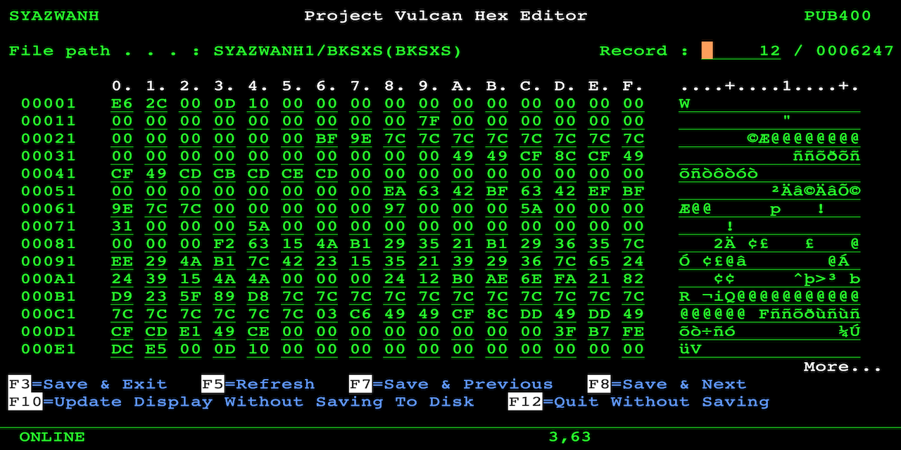

# AS400 Hex Editor
Edit a PF-DTA content in hex on a side-by-side display of EBCDIC character representation.

## Introduction
This tool was written to edit hex values directly from 5250 display. Not all characters can be input from keyboard and requires modification of hex values, especially when fixing broken double-byte or packed values.

## How to Compile
First, upload the source to your AS/400 using FTP or other similar means, then set the correct source type for each member:
1. PVHEXEDT RPGLE
2. PVHEXEDTU C
3. PVHEXEDTD DSPF

Compile the DSPF first using option 14. Then the RPGLE and C using option 15. Finally, issue CRTPGM PGM(PVHEXEDT) MODULE(PVHEXEDT PVHEXEDTU). If you run into any difficulties with the source code, please verify that:
1. The source physical file ('PF') is at least 112 in length, for example, CRTSRCPF FILE(QRPGLESRC) RCDLEN(112).
2. The code page of the PF and your job is 37, for example, CHGJOB CCSID(37).
3. The FTP mode of transfer was set to ASCII during upload.

## Running the Program
The parameter list of the program is:
1. PF name
2. LIB name
3. MBR name

For example, CALL PVHEXEDT PARM('MYFILE' 'MYLIB' 'MBR').

If your LIB/FILE,MBR path is valid, the screen will load and the navigation keys are displayed at the bottom of the display.
